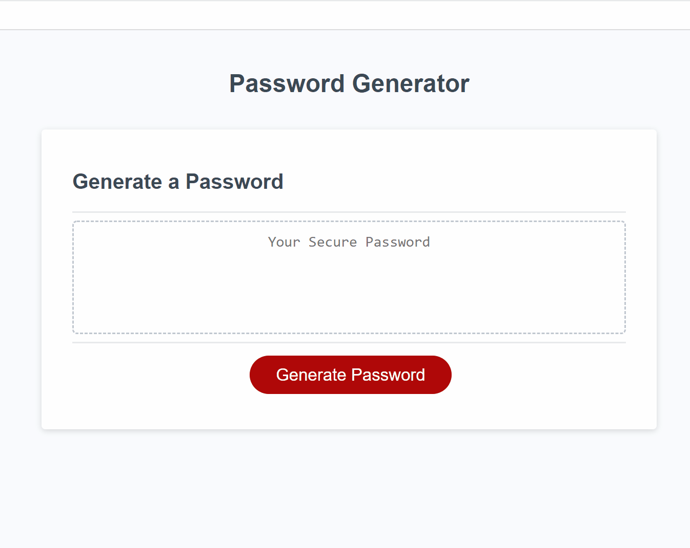

# Password-Generator
A simple and effective password generator.

# Mission

My mission on this assignment was to create a random password generator that met certain criteria so that I can create a strong password that provides greater security.

# Process

I was lucky enough that my instructor, and TA went over the beginning parts with the class and guided me on how to start and how the flow of my code would be most effective. As advised, although still unfamiliar, I started with my pseudo code on what my end game would accomplish. Then right after class, I had a tutoring session who also talked over what additional things that I should look at, add or reference to. 

The process of functions was another beast of itself and tying back to, looping and if and else if statements took me for a whirl.

As all coders will eventually learn, "try a little, test a little", because if you don't- you will end up with your project not functioning correctly and not know where it all went wrong. As I learned that grueling lesson with this homework, I give thanks to all the resources that were available to me and their never-ending patience.

I still need to get in the habit of working on code as the function dictates rather than trying to code in sequential line order as if reading a page of a book.

I started with all the variables that I would need for the password along with the confirming variables that I would call later in my later functions. I moved to making a new function for getting the prompts per the user choice along with all the if and else if combinations based on user selections. 

After finishing up the functions for writing a password and then finally the generating password function, I had a fully working password generator. 

During the office hours my TA looked over my code and then taught me a much shorter and efficient way of cutting through my user selection combinations and utilizing "push" instead.  

# Finished!

I give complete credit to my instructor, TA and tutor who are always willing to sit through my mess and help me sort it all out. As frustrating this was, it was also a good lesson to "get comfortable with being uncomfortable" -My Awesome Tutor.

# Have a Look See

# [See It For Yourself Here](https://jlee3883.github.io/Password-Generator/) ❤️️

